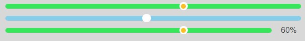

# chen-ui

## 前言

* chen-ui是一个有趣的ui组件库，包含了一些开发中可能会经常用到的组件，也包含一些个人觉得有趣但不是很常用的组件。
* 目前该组件库还没有成型。如果有想使用该组件库的一些组件，可以到该组件的目录下复制该组件代码。后期如果组件多起来的话会考虑发布到npm上供大家使用。
* 设计想法：区别于常见的ui组件库，想支持更多的自定义ui样式，例如颜色、大小等。
* 该组件库会不定时更新一些组件（主人很懒）。
* 欢迎有兴趣的小伙伴加入。有好的意见也欢迎提出来。

## 介绍及使用

1. CProgress 进度条

> 位置：/packages/Progress/src

具体样式

<center>
    
</center>

代码示例

```html
    <c-progress :percent.sync="percent" />
    <c-progress :percent.sync="percent" progress-color="skyblue" solid-color="white" />
    <c-progress :percent.sync="percent" is-show-percent />
```

|属性|描述|类型|可选值|默认|
|----|----|----|----|----|
|percent|进度条百分比，**必须**|Number|0-100|none|
|width|宽度|Number|--|100%|
|solidColor|滑块颜色|String|css支持的所有颜色，包括rgb/rgba/十六进制等|rgb(252, 191, 35)|
|progressColor|进度条颜色|String|css支持的所有颜色，包括rgb/rgba/十六进制等|rgb(56, 230, 91)|
|isShowPercent|是否显示百分比|Boolean|true/false|false|
|isChange|是否允许改变进度|Boolean|true/false|false|

2. 敬请期待

## 联系

> QQ：2278775938  
> QQ邮箱：2278775938@qq.com
